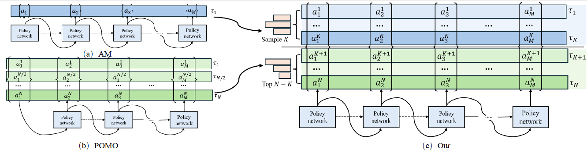

# Uni-POMO: Toward a Unified Policy Optimization Strategy for Cross-Variant Vehicle Routing Problems

**Uni-POMO** is a unified policy optimization framework designed to boost the performance of Neural Combinatorial Optimization (NCO) solvers across diverse Vehicle Routing Problem (VRP) variants.

---

# Example:

## 🌟 Key Highlights

* **Original Settings:** Uni-POMO boosts the classic POMO baseline, achieving better results with almost no loss in inference speed.
* **Cross-task:** Uni-POMO enhances cross-task models like MTPOMO, MVMoE, and RF-TE, ensuring stable gains across various complex VRP tasks.
* **Cross-size:** Uni-POMO improves cross-size models like ELG, DAR, and ReLD, delivering strong performance even as the problem size scales up.

---

## ⚙️ Installation

### Environment Setup
* We recommend using uv (Python package manager) to manage the dependencies. All models are trained in this environment.
*  uv venv --python 3.12 # create a new virtual environment
*  source .venv/bin/activate # activate the virtual environment
*  uv sync --all-extras # for all dependencies
* Note that this project is also compatible with normal pip install -e . in case you use a different package manager.

# 1. Original Settings
For training and testing code on single problem (CVRP, VRPTW), please refer to [.\Baseline\POMO].

# 2. Cross-task
For training and testing code on model generalization across tasks, please refer to [.\Baseline\routefinder-main].

# 3. Cross-size
For training and testing code on model generalization across different problem sizes, please refer to [ .\Baseline\reld-nco-main].

## 📂 Datasets
* **Benchmark**: .\Data\Benchmark
* **Cross-size**: .\Data\cross_size_data
* **Cross-task**: .\Data\cross_task_data

## 🤗 Acknowledgements
* https://github.com/yd-kwon/POMO
* https://github.com/lamda-bbo/ELG
* https://github.com/ziweileonhuang/reld-nco
* https://github.com/FeiLiu36/MTNCO/tree/main
* https://github.com/RoyalSkye/Routing-MVMoE
* https://github.com/ai4co/routefinder
